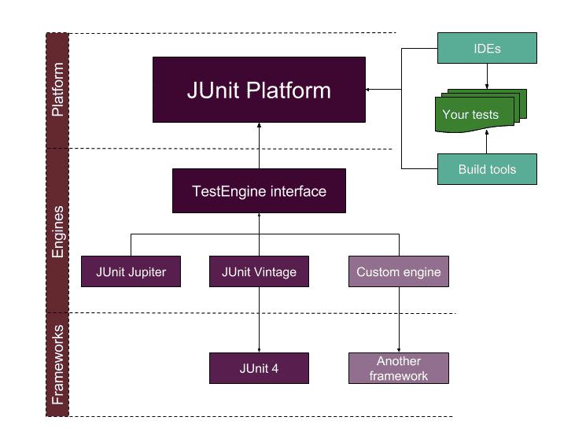

# CS11/06(JUnit)

# JUnit?

---

자바 개발자가 가장 많이 사용하는 테스팅 기반 프레임워크.(자바 개발자의 93%가 사용)

자바 8이상, 스프링부트 2.2이상부터는 JUnit5를 사용하며 이전엔 3,4버전을 사용한다.

**JUnit5 = JUnit Platform + Jupiter + Vintage**

- JUnit Platform = 테스트를 실행해주는 런처 제공. TestEngine API제공
- Jupiter = JUnit5를 지원하는 TestEngine API구현체
- Vintage = JUnit 4와 3을 지원하는 TestEngine API 구현체

AssertJ : Assertion을 제공하며 체이닝 메소드를 제공하는 라이브러리. 결국 우리가 원하는 테스트를 해보기 위해서는 assertThat 등의 메소드를 사용한다. static 메소드이다.

(assert = 단정짓다.)



**따라서 스프링에서의 테스트는 JUnit(프레임워크) + Assertions(메소드)로 이루어짐**

# 사용법

---


JUnit을 사용하기 위해선 어노테이션과 Assertions메소드들을 알아야 한다.

1. **기본 어노테이션**

   - @Test : 테스트를 만드는 모듈 역할

   ```java
   @Test
       void 회원가입() {
           //테스트 패턴은 given - when - then 패턴 추천

           //given
           Member member = new Member();
           member.setName("spring");

           //when
           Long saveId = memberService.join(member);

           //then
           Member findMember = memberService.findOne(saveId).get();
           assertThat(member.getName()).isEqualTo(findMember.getName());

       }
   ```

   - @DisplayName : 테스트 클래스 또는 테스트 메서드의 사용자 저으이 표시 이름을 정의. 기본 자바와는 다르게 한글, 특수문자, 이모지 등 사용 가능하다.

   ```java
   @Test
       @DisplayName("╯°□°）╯")
       void testWithDisplayNameContainingSpecialCharacters() {
       }

       @Test
       @DisplayName("😱")
       void testWithDisplayNameContainingEmoji() {
       }
   ```

   - 생명주기(LifeCycle) 어노테이션
     - @BeforeAll: 해당 클래스에 위치한 모든 테스트 메서드 실행 전에 `딱 한 번` 실행되는 메소드, 보통 설정 등에 활용된다.
     ```java
     @BeforeAll
         public static void beforeAll(){
             memberRepository = new MemoryMemberRepository();
             memberService = new MemberService(memberRepository); //이러면 같은 MemoryMemberRepository 객체를 사용한다.
         }
     ```
     - @AfterAll: 해당 클래스에 위치한 모든 테스트 메서드 실행 후에 `딱 한 번` 실행되는 메소드, (레거시한 코드를 사용할 경우 close() 등과 같은 메서드를 설정할 수 있음.)
     - @BeforeEach: 해당 클래스에 위치한 모든 테스트 메서드 실행 전에 실행되는 메서드
     - @AfterEach: 해당 클래스에 위치한 모든 테스트 메소드 실행 후에 실행되는 메소드
     ```java
     @AfterEach
         public void afterEach(){
             memberRepository.clearStore();
         }
     ```
   - @Disable: 테스트 클래스 또는 메서드를 비활성화

   - @RepeatedTest: 특정 테스트를 반복시키고 싶을 때, 반복 횟수설정 가능, 성능 테스트

   ```java
   @RepeatedTest(10)
   @DisplayName("반복 테스트")
   void repeatedTest(){
   ...
   }
   ```

   - @Parameterized Tests: 한번의 테스트 실행에서 for문 처럼 여러번 돌릴 수 있음.

   ```java
   @ParameterizedTest
       @ValueSource(ints = {1, 3, 5, -3, 15, Integer.MAX_VALUE}) // six numbers
       void isOdd_ShouldReturnTrueForOddNumbers(int number) {
           assertTrue(number%2==1);
       }
   ```

%20e7f8078c2a1e4e4c82fe33b5b75be0f6/Untitled%202.png>)

1. **Assertions 메소드들**

메소드들을 살펴보기 이전에 테스트를 할 간단한 service 메소드들을 살펴보자.

```java
public Long join(Member member){

        //같은 이름이 있는 중복 회원X
        validateDuplicateMember(member);

        memberRepository.save(member);
        return member.getId();
    }

    private void validateDuplicateMember(Member member) {


        Optional<Member> result = memberRepository.findByName(member.getName());
        result.ifPresent(m -> {
            throw new IllegalStateException("이미 존재하는 회원입니다.");
        });
    }

    /*
    * 전체 회원 조회
    * */
    public List<Member> findMembers(){
        return memberRepository.findAll();
    }

    public Optional<Member> findOne(Long memberId){
        return memberRepository.findById(memberId);
    }
```

- **assertThat**(): 안에 그냥 Assertions 메소드가 아니라 우리가 아는 자바 코드를 사용할 수 있어서 자주 사용된다.
- **assertEquals**(a,b): 객체 A와 B가 같은 값을 가지는지 확인
- **assertSame**(a,b): 객체 A와 B가 같은 객체임을 확인
  ```java
  @Test
      void 회원가입() {
          //테스트 패턴은 given - when - then 패턴 추천

          //given
          Member member = new Member();
          member.setName("spring");

          //when
          Long saveId = memberService.join(member);

          //then
          Member findMember = memberService.findOne(saveId).get();
  //        assertThat(member.getName()).isEqualTo(findMember.getName());

          assertEquals(member,findMember);
      }
  ```

%20e7f8078c2a1e4e4c82fe33b5b75be0f6/Untitled%203.png>)

- **assertAll**(): 안에 있는 모든 테스트들을 일단 모두 실행 시킨 뒤 테스트 진행

```java
@Test
    void 계산(){
        assertAll(
                ()-> assertEquals(2,1-1),
                ()-> assertEquals(0,1-1)
        );
    }
```

이럴 경우 위는 같지만 아래는 다르기 때문에 틀렸다고 나온다.

%20e7f8078c2a1e4e4c82fe33b5b75be0f6/Untitled%204.png>)

- **assertThrows**(): 예외를 발생시키는 것을 테스트 하고 싶을 때

```java
@Test
    public void 중복_회원_예외(){
        //given
        Member member = new Member();
        member.setName("spring");

        Member member2 = new Member();
        member2.setName("spring");

        //when
        memberService.join(member);


				//then
        //방법 2
        IllegalStateException e = assertThrows(IllegalStateException.class,
																								 () -> memberService.join(member2));

        assertThat(e.getMessage()).isEqualTo("이미 존재하는 회원입니다.");

        /* 방법1
        try{
            memberService.join(member2);
            fail("예외가 발생해야 합니다.");
        }catch (IllegalStateException e ){
            assertThat(e.getMessage()).isEqualTo("이미 존재하는 회원입니다.");
        }*/


    }
```

- **assumeTrue**() / **assumingThat**()
  - assumeTrue(): false일때 이후 `테스트 전체`가 실행되지 않음
  ```java
  @Test
      void assumeTrue테스트(){
          assumeTrue("DEV".equals(System.getenv("ENV")), ()-> "개발 환경이 아닙니다.");
          assertEquals("A","A");//단정문이 실행되지 않음.
      }
  ```
  - assumingThat(): 파라미터로 `전달된 코드블럭`만 실행되지 않음
  ```java
  @Test
      void assumingThat테스트(){
          assumingThat("DEV".equals(System.getenv("ENV")),
                  ()->{
                      assertEquals("A","B"); //단정문이 실행되지 않음
                  });
          assertEquals("A","A"); //단정문이 실행됨.
      }
  ```
