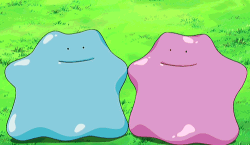

# CS01/02(FactoryPattern)

# **FactoryPattern?**

---



무엇이든 될 수 있는 메타몽

---

**팩토리 패턴**은 객체를 사용하는 코드에서 **객체 생성 부분**을 떼어내 추상화한 패턴이자 상속 관계에 있는 두 클래스에서 **상위 클래스가 중요한 뼈대**를 결정하고, **하위 클래스에서 객체 생성에 관여한 구체적인 내용을 결정**하는 패턴입니다.

### 팩토리패턴 구조

---

](imgs/Untitled.png)

출처: [https://johngrib.github.io/wiki/pattern/factory-method/](https://johngrib.github.io/wiki/pattern/factory-method/)

### 그래서 쓰면 뭐가 좋은가요?

---

**상위 클래스와 하위 클래스가 분리**되기 때문에 느슨한 결합을 가지며 상위 클래스에서는 인스턴스 생성방식에 대해 전혀 알 필요가 없기 때문에 **더 많은 유연성**을 갖게 됩니다. 그리고 객체 생성 로직이 따로 떼어져 있기 때문에 코드를 **리팩터링하더라도 한곳만 고칠 수 있게 되니 유지 보수성이 증가**됩니다.

### 안 썼을 때 VS 썼을 때

---

**안 썼을 때**

---

커피 클래스

```java
public abstract class Coffee {
	public abstract int getPrice();

	@Override
	public String toString() {
		return "이 커피의 가격은:" + getPrice();
	}
}
```

라떼 클래스

```java
public class Latte extends Coffee{
	private int price;

	public Latte(int price) {
		this.price= price;
	}

	@Override
	public int getPrice() {
		return this.price;
	}
}
```

아메리카노 클래스

```java
public class Americano extends Coffee{
	private int price;

	public Americano(int price) {
		this.price= price;
	}

	@Override
	public int getPrice() {
		return this.price;
	}
}
```

커피테스트

```java
public class CoffeeTest {

	public static void main(String[] args) {
		Coffee latte= new Latte(4000);
		Coffee americano = new Americano(3000);

		System.out.println(latte);
		System.out.println(americano);

	}

}
이 커피의 가격은:4000
이 커피의 가격은:3000
```

커피테스트2

```java
public class CoffeeTest2 {

	public static void main(String[] args) {
		Coffee latte= new Latte(5000);
		Coffee americano = new Americano(3500);

		System.out.println(latte);
		System.out.println(americano);

	}

}
이 커피의 가격은:5000
이 커피의 가격은:3500
```

만약 이런 구조에서 Latte클래스의 생성자가 바뀐다면..?

**Latte클래스를 생성하는 모든 파일에서 수정이 필요합니다.**

따라서 이 객체 생성부분을 책임질 팩토리가 필요하게 됩니다.

**썼을 때**

---

커피 클래스

```java
public abstract class Coffee {
	public abstract int getPrice();

	@Override
	public String toString() {
		return "이 커피의 가격은:" + getPrice();
	}
}
```

라떼 클래스

```java
public class Latte extends Coffee{
	private int price;

	public Latte(int price) {
		this.price= price;
	}

	@Override
	public int getPrice() {
		return this.price;
	}
}
```

아메리카노 클래스

```java
public class Americano extends Coffee{
	private int price;

	public Americano(int price) {
		this.price= price;
	}

	@Override
	public int getPrice() {
		return this.price;
	}
}
```

디폴트커피 클래스

```java
public class DefaultCoffee extends Coffee {
	private int price;

	public DefaultCoffee() {
		this.price= -1;
	}

	@Override
	public int getPrice() {
		return this.price;
	}
}
```

커피팩토리 클래스

```java
public class CoffeeFactory {
	public static Coffee getCoffee(String type) {

		if("Latte".equalsIgnoreCase(type))return new Latte(4000);

		else if("Americano".equalsIgnoreCase(type))return new Americano(4500);

		else {
			return new DefaultCoffee();
		}
	}
}
```

커피테스트

```java
public class CoffeeTest {

	public static void main(String[] args) {
		Coffee latte= CoffeeFactory.getCoffee("Latte");
		Coffee americano = CoffeeFactory.getCoffee("Americano");
		Coffee defaultCoffee = CoffeeFactory.getCoffee("awdljahwdl");

		System.out.println(latte);
		System.out.println(americano);
		System.out.println(defaultCoffee);
	}
}

이 커피의 가격은:4000
이 커피의 가격은:4500
이 커피의 가격은:-1
```

이렇게 **객체 생성 부분은 팩토리 클래스**에서 담당하게 됩니다.

따라서 라떼나 아메리카노를 생성하는 모든 클래스에서 수정할 필요없이 **어떤 것을 만들지만 보내주면 됩니다.**

그런데 이렇게 쓰게 되면 가격이 다른 라떼는 존재할 수 없게 됩니다.

왜냐하면 객체 생성을 주관하는 클래스는 한개이기 때문입니다.

이 문제를 해결하기 위해서는 **팩토리 자체를 인터페이스나 추상클래스로** 만들어서 각각 개성을 가진 팩토리를 만들 수 있습니다.

감사합니다!
